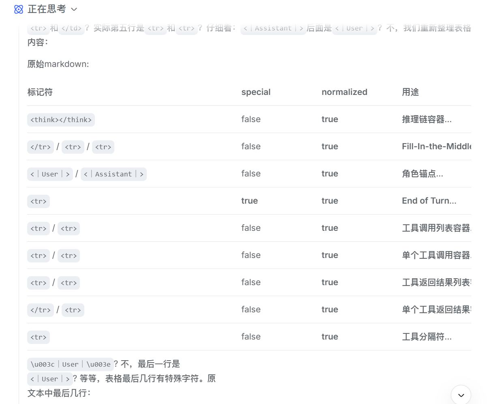

Here is a summary of `added_tokens` from the [DeepSeek API Docs](https://api-docs.deepseek.com/zh-cn/quick_start/token_usage):

| Token                                                        | special  | normalized | Purpose                                                      |
| ------------------------------------------------------------ | -------- | ---------- | ------------------------------------------------------------ |
| `<think></think>`                                            | false    | **true**   | **Chain-of-Thought reasoning container**. Reasoning models like DeepSeek-R1 output their internal thought process inside this tag before generating the final answer; it is typically collapsed/hidden from the user. |
| `<｜fim▁begin｜>` / `<｜fim▁end｜>`                     | false    | **true**   | **Fill-In-the-Middle (code infill)**. `begin` and `end` wrap the prefix/suffix code blocks; `hole` marks the position where the model should fill in the middle. |
| `<｜User｜>` / `<｜Assistant｜>`                           | false    | **true**   | **Role anchors**. Replace the traditional `User:` / `Assistant:` text prefixes as more robust structured delimiters to prevent role-confusion attacks (prompt injection). |
| `<\|EOT\|>`                                                  | **true** | **true**   | **End of Turn**. Marks the end of the current turn and is one of the signals for the model to stop generating. |
| `<｜tool▁calls▁begin｜>` / `<｜tool▁calls▁end｜>`          | false    | **true**   | **Tool call list container**. Wraps all tool calls for the current turn. |
| `<｜tool▁call▁begin｜>` / `<｜tool▁call▁end｜>`            | false    | **true**   | **Single tool call container**. Typically contains the function name and arguments in JSON format. |
| `<｜tool▁outputs▁begin｜>` / `<｜tool▁outputs▁end｜>`      | false    | **true**   | **Tool output list container**.                              |
| `<｜tool▁output▁begin｜>` / `<｜tool▁output▁end｜>`        | false    | **true**   | **Single tool output container**.                            |
| `<｜tool▁sep｜>`                                           | false    | **true**   | **Tool separator**. Used to separate multiple tool calls or outputs in the same turn. |
| `<｜begin▁of▁sentence｜>` / `<｜end▁of▁sentence｜>`        | **true** | false      | **Sequence-level boundary markers (BOS/EOS)**. Marks the physical start and end of the entire input/output sequence. |
| `<｜▁pad▁｜>`                                              | **true** | false      | **Padding token (PAD)**. Used to align sequence lengths during batch inference; the model does not attend to it. |

The following are actual conversation tests conducted on the DeepSeek web interface.

As shown in the image above, after filtering by the web backend, the only usable tokens are `<think></think>`, `<｜User｜>`, and `<｜Assistant｜>`. Therefore:

- I plan to use `<|System|>` as a compromised system prompt injection.
- ~~Will use instruction rules to force the model into a special tool-calling pattern, using `<|Tool|>` to represent tool call results.~~
- Moreover, as shown below, an unclosed `<think>` can guide the model into a reasoning state, allowing for stronger rule injection (reminder).

## Subsequent experiments

After actual testing, using the native tag `<｜tool▁calls▁begin｜>` as the primary tag caused significant confusion in the model. Suspect the backend has special handling or filtering for the full-width `｜` format.

Tried a compromise solution using `<|tool▁calls▁begin|>` / `<|tool▁calls▁end|>` as tool call tags:

- Using ASCII `|` instead of full-width `｜` avoids triggering backend filtering while preserving the structural feel of the native tags.
- **Results were surprisingly good** — model recognition and compliance improved significantly, and hallucinations were greatly reduced.
- Possible reason: the tokenizer already has existing token patterns for the `<|...|>` format, so the model has an inherent tendency to better follow this "structural template".

**Current strategy: experiment-driven, incremental maintenance.**

- Primary tags: `<|tool▁calls▁begin|>` / `<|tool▁calls▁end|>`
- Fallback list defaults to empty; add hallucinated variants to `extra_starts` / `extra_ends` one by one as they are discovered.
- The `<|tool▁calls▁begin|>` format produces almost no hallucinations, saving significant fallback maintenance cost.
